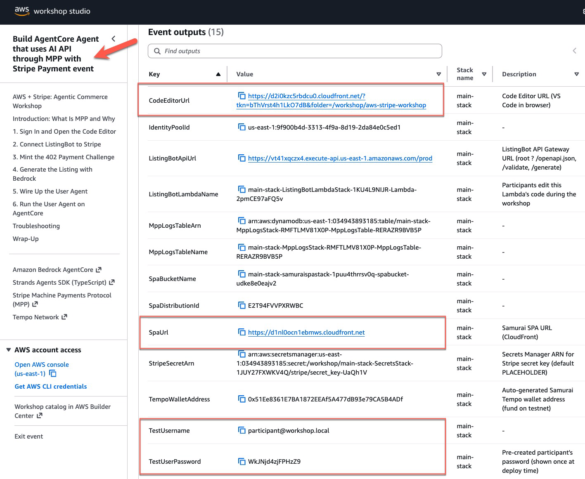
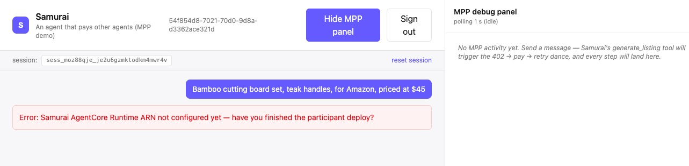
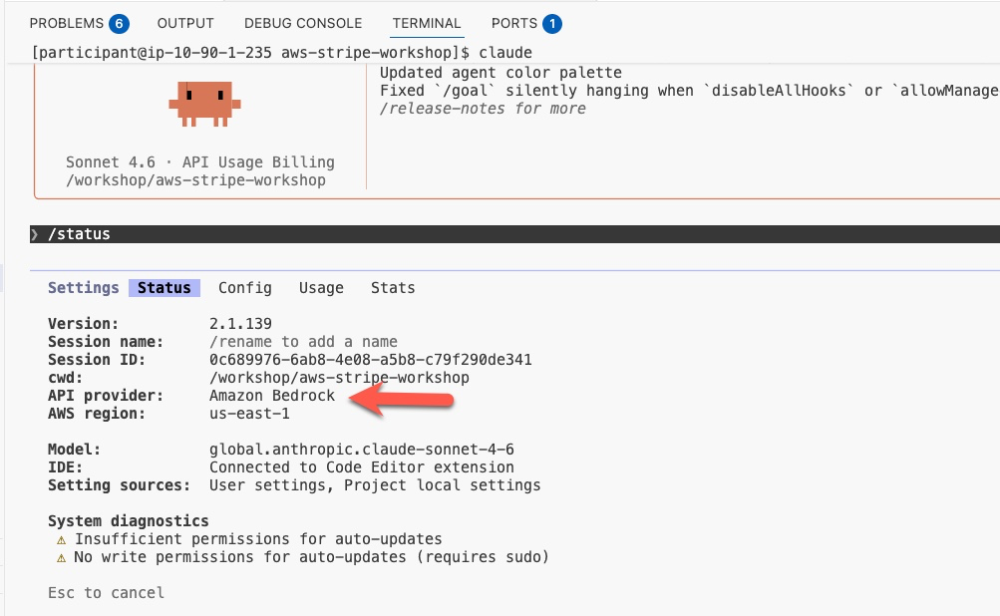
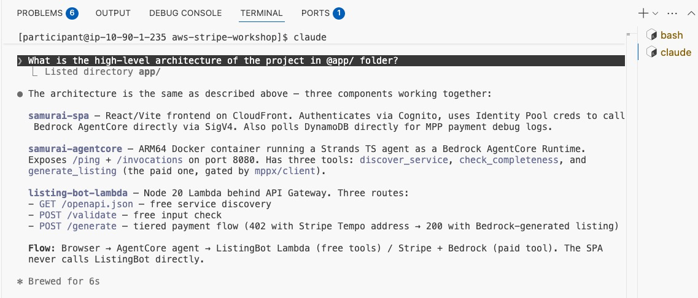
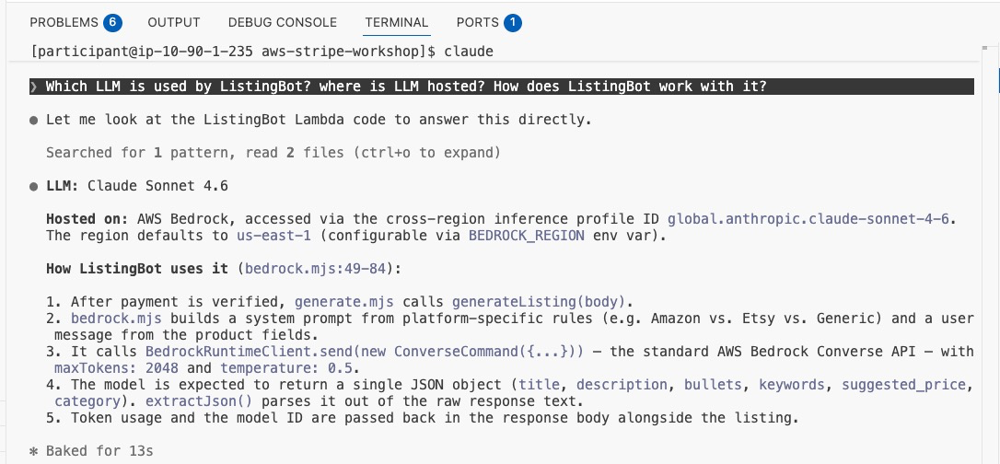

The workshop CloudFormation stacks have already been deployed your environment. Grab these from the **Outputs** tab of the root CloudFormation stack:

- `CodeEditorUrl` — VS Code in your browser
- `SpaUrl` — the Samurai SPA (**S**ingle-**P**age **A**pplication web portal)
- `TestUsername` (defaults to `participant`) 
- `TestUserPassword`



:::alert{type="info"}
You'll spend steps 2–4 adding monetization layer on **ListingBot's Lambda** — a paid Gen AI service you launch. Steps 5–6 wire up **Samurai**, the user agent we ship so you can demo how a user agent is able to request and pay for your service. The split is 3 TODOs on ListingBot, 2 TODOs on Samurai.
:::

### Sign In to the Samurai SPA

1. Open `SpaUrl` in a new tab.
2. Sign in with the test username + password from the Outputs tab.
3. Leave the tab open — we will come back to it after the first TODO.

:::alert{type="info"}
The SPA is a static bundle on CloudFront. On login Amplify swaps your Cognito ID token for temporary AWS credentials via the Identity Pool, and calls `bedrock-agentcore:InvokeAgentRuntime` **directly from the browser** (SigV4-signed). There is no backend-for-frontend Lambda.
:::

**What You Will See in the SPA**

A chat pane on the left, a debug panel on the right. If you type a message now it will say *"Samurai AgentCore Runtime ARN not configured yet"* — that is expected. This is because we haven't wired up Samurai's AgentCore Runtime, which is the **last TODO** (you build it in step 6). 




### Open the Code Editor

Click the `CodeEditorUrl`. You will land in a web VS Code with this repo at `/workshop/aws-stripe-workshop`:

```
app/
├── listing-bot-lambda/   ← you'll edit this (TODOs 2, 3 — ListingBot)
├── samurai-agentcore/    ← you'll edit this (TODO 4 + TODO 5.1, 5.2 — system prompt + Memory wiring)
└── samurai-spa/          ← reference only (already deployed)
workshop/
└── code/
    └── participant/      ← CFN + deploy script (TODO 5.3, 5.4 — env var + IAM)
config.env                ← auto-sourced; do not edit
```

The terminal has `config.env` auto-sourced. Verify:

```bash
echo $LISTINGBOT_LAMBDA_NAME     # the Lambda name to redeploy into
echo $LISTING_BOT_API_URL        # API Gateway URL
echo $SPA_BUCKET                 # SPA S3 bucket (participant-deploy.sh uses this)
echo $CLAUDE_CODE_USE_BEDROCK    # Point Claude Code to use LLM in Bedrock
echo $ANTHROPIC_MODEL            # Default model used by Claude Code
```

### Use Claude Code

The Code Editor terminal has [Claude Code](https://docs.claude.com/en/docs/claude-code/overview) pre-installed and pre-configured to use Amazon Bedrock as its LLM backend. The two relevant environment variables you just verified — `CLAUDE_CODE_USE_BEDROCK=1` and `ANTHROPIC_MODEL` — tell Claude Code to call Bedrock through the EC2 instance role instead of an Anthropic API key, so there's nothing more to set up.

Open a new terminal, and start Claude Code:

```bash
claude
```

Inside the Claude Code TUI, run the slash command:

```text
/status
```

You should see `Model:` set to `global.anthropic.claude-sonnet-4-6` and an indication that the API provider is Bedrock. 



#### Why Claude Code Is Useful for This Workshop

Claude Code can read files in the repo, run shell commands, and reason about the architecture in plain English. Two ways it helps during the workshop:

- **Get oriented fast.** The repo has three top-level apps and several CloudFormation stacks; Claude Code can summarise any of them on demand without you having to grep through files.
- **Troubleshoot when something goes wrong.** If a TODO step fails — Lambda returns 500, AgentCore Runtime fails to deploy, the SPA shows a blank screen — paste the error message and Claude Code will suggest where to look.

#### Try Two Prompts Now

In the Claude Code prompt, run each of these and read the response:

**1. Get a high-level overview of the application code.**

```text
What is the high-level architecture of the project in @app/ folder?
```

The `@app/` syntax tells Claude Code to read every file under `app/` before answering. You should get back a description of the three modules (`listing-bot-lambda`, `samurai-agentcore`, `samurai-spa`) and how they fit together.



**2. Drill into one specific question.**

```text
Which LLM is used by ListingBot? Where is LLM hosted? How does ListingBot work with LLM?
```

This one is narrower — Claude Code will trace the code path from the Lambda handler down to the Bedrock Converse call, name the model id and inference profile, and explain the Bedrock IAM grant.




You can use Claude Code at any point during the workshop to ask similar questions about the participant CFN, the Strands agent, or the debug panel. It runs entirely in the Code Editor terminal — no extra tabs to manage.
