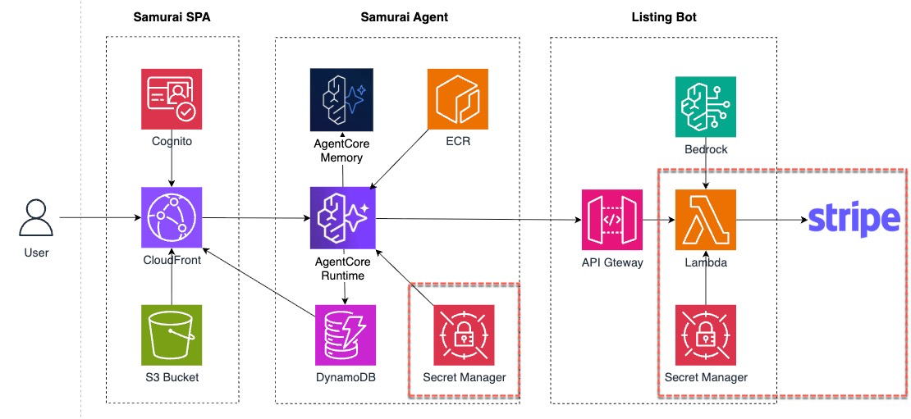
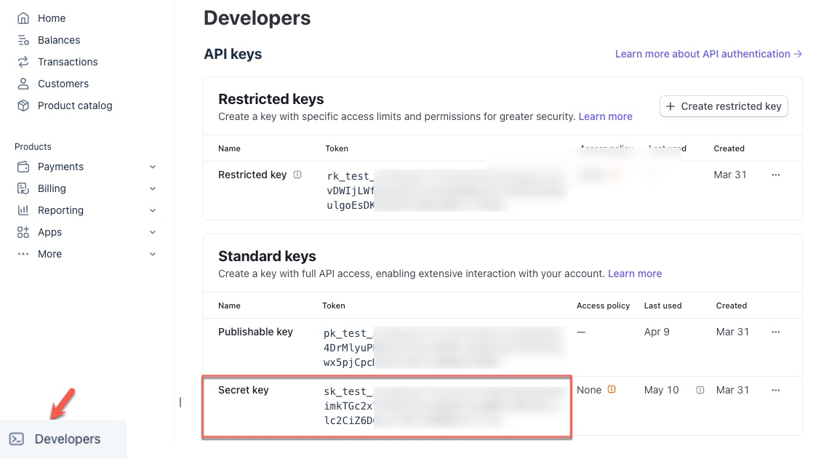
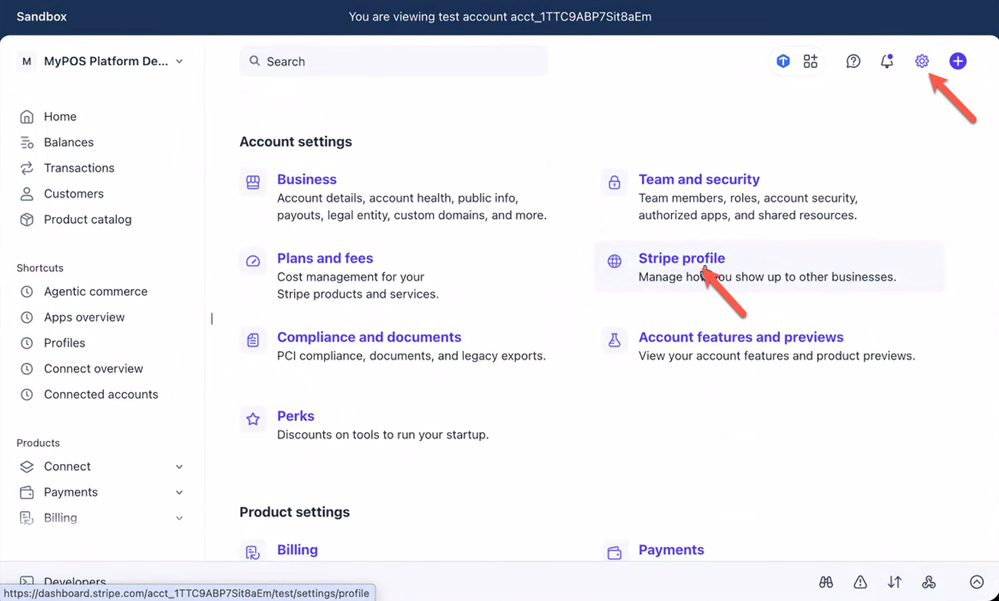
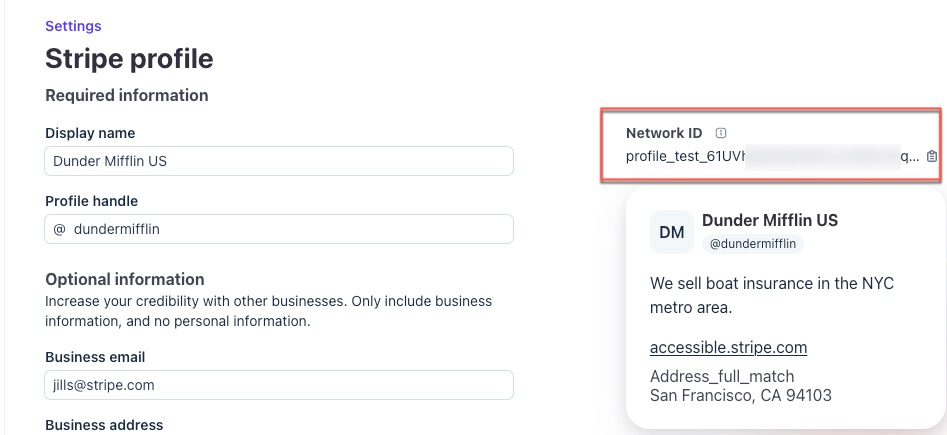

ListingBot charges for every listing it generates. To make those charges work end-to-end, you'll set up the monetization layer with the [Machine Payment Protocol](https://mpp.dev/) (MPP) and [Stripe](https://docs.stripe.com/payments/machine/mpp?mpp-method=spt).

**Setup orientation.** You're the builder — the **merchant** who owns ListingBot, the seller API service. A pre-baked demo agent called **Samurai** plays the **buyer agent**, paying ListingBot on behalf of a human user. For the MPP round-trip to move real money, both sides need their own Stripe credentials.

We use AWS Secret Manager to securely store the secret keys for Stripe. 



### Two Parties, Two Stripe Accounts

| Role                                | Stripe Accounts              | Stripe value(s)                | Source                                                                                                            |
| ----------------------------------- | ---------------------------- | ------------------------------ | ----------------------------------------------------------------------------------------------------------------- |
| **Buyer** **Agent** (Samurai)       | A shared demo Stripe sandbox | `sk_test_…`                    | **Your workshop instructors will share a single buyer key for all participants.** You paste it in step 1.1 below. |
| **Seller API Service** (ListingBot) | **Your own Stripe sandbox**  | `sk_test_…` + `profile_test_…` | You grab from the Stripe Dashboard and paste in steps 1.2 and 1.3 below.                                          |

The buyer's Stripe account is **separate** from yours. When Samurai receives a 402 from your ListingBot, it creates a fresh one-time **Shared Payment Token**(SPT) **against the buyer's account**, scoped to **your Stripe Merchant Account Profile** `profile_test_`, and attaches it on retry. The PaymentIntent will land in **your** Stripe Dashboard — you see the charge as a merchant; your instructors see the SPT issuance as the buyer.

### TODO 1 — Paste All Three Values

The Lambda and Samurai re-read each secret every 30 seconds, so no redeploy is needed after any `put-secret-value`.

#### 1.1 — Paste the Buyer Stripe Secret Key

:::alert{type="info"}
Your workshop instructors will announce the shared demo-buyer `sk_test_…` value during the session. Substitute it below. It's the same key every participant uses.
:::

```bash
aws secretsmanager put-secret-value \
  --secret-id "$BUYER_STRIPE_SECRET_ARN" \
  --region "$AWS_REGION" \
  --secret-string "sk_test_BUYER_KEY_FROM_INSTRUCTORS"
```

That's it for the buyer — Samurai will read it automatically at container start.

#### 1.2 — Paste Your Own Stripe Secret Key (You as Seller)

Grab your own Stripe sandbox secret key (Stripe Dashboard → Developers → API keys → Sandbox → Secret key, starts with `sk_test_…`):



```bash
aws secretsmanager put-secret-value \
  --secret-id "$STRIPE_SECRET_ARN" \
  --region "$AWS_REGION" \
  --secret-string "sk_test_YOUR_SELLER_KEY"
```

#### 1.3 — Paste Your Stripe Profile ID (You as Seller)

In Stripe Dashboard, go to Settings -> Stripe profile, or search `profile` directly in the search bar and choose Stripe profile. Get the Network ID (`profile_test_...`)
You can read more about [Stripe Profile here](https://docs.stripe.com/get-started/account/profile)






```bash
aws secretsmanager put-secret-value \
  --secret-id "$STRIPE_NETWORK_ID_ARN" \
  --region "$AWS_REGION" \
  --secret-string "profile_test_YOUR_PROFILE_ID"
```

:::alert{type="info"}
All three secrets have a 30-second cache. If a subsequent step still shows mock responses, wait 30 s and retry.
:::

### Mock Mode Fall-Back

If any of the three secrets remains `PLACEHOLDER` (e.g. you're skipping the real-Stripe path, or your instructors haven't shared the buyer key yet), the Lambda detects mock mode and fakes the full 402 → retry → 200 round-trip locally — no Stripe calls, no PaymentIntents, but every TODO still completable end-to-end.

### Smoke-Test

Verify the seller key you just stored is valid by asking Stripe to describe your account:

```bash
STRIPE_KEY=$(aws secretsmanager get-secret-value \
  --secret-id "$STRIPE_SECRET_ARN" \
  --region "$AWS_REGION" \
  --query SecretString --output text)

curl -s https://api.stripe.com/v1/account -u "$STRIPE_KEY:" \
  | grep -E '"id"|"email"|"livemode"|"error"'
```

Expected output — an account id, your Stripe account email, and `"livemode": false`:

```
  "id": "acct_1TGw...",
  "email": "you@example.com"
```

If you see `"Invalid API Key provided"`, re-copy the key from the Stripe Dashboard and re-run the `put-secret-value` in step 1.2. If you see no output at all, the secret is still `PLACEHOLDER` — you skipped step 1.2.

### What the MPP Flow Looks Like with This Wiring

1. **Samurai** POSTs `/generate` with no auth.
2. **ListingBot** (your Lambda, once TODO 2 is done) responds with `402` and a Challenge containing the amount, currency, and Stripe method details (Business Network profile, allowed payment method types).
3. **Samurai** reads your profile out of the challenge, then calls Stripe's `POST /v1/shared_payment/issued_tokens` endpoint using the shared buyer `sk_test_` (step 1.1) to create a one-time SPT **scoped to your seller profile**, for exactly the challenge amount.
4. **Samurai** retries with `Authorization: Payment spt=spt_test_…`.
5. **ListingBot** hands the SPT to `mppx/server`, which calls `paymentIntents.create({ payment_method_data: { shared_payment_granted_token: spt } })` using **your** `sk_test_`.
6. Stripe verifies the SPT is granted to a profile the caller owns. Since both sides match, it succeeds.

The Payment lands in **your** Stripe Dashboard — your `profile_test_` received a $1.00 payment funded by the buyer's `pm_card_visa` test card.

### What You Just Did

You pasted three Stripe values — one from the instructors (buyer), two from your own Stripe sandbox (seller). Next chapter, you wire `stripe.charge` into the Lambda so it actually advertises the profile in its 402 challenges.
