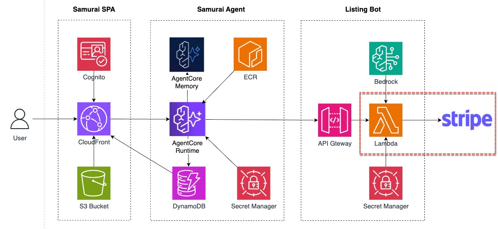

This is the heart of ListingBot: the service that accepts a `/generate` request, hands any retry credential to `mppx`, and lets the library settle the payment against Stripe. The library builds the actual `WWW-Authenticate` header and calls `stripe.paymentIntents.create` internally — your job is to **tell it which payment method you accept** by registering `stripe.charge` in the `methods` array.

:::alert{type="info"}
**TIP:** In the Visual Studio Code editor, you can use **`Command + P`**(Mac) or **`CMD+P`** (Windows) and type the file name to go to a file quickly.
:::

Lambda function in the Listing Bot will call Stripe to receive payment.



### TODO 2 — Register `stripe.charge` With `mppx/server`

`mppx/server` exports a `Proxy` server handler so that you can create or define a 402-protected payments proxy. For this case, you will  it will accept payments through Stripe.

Function reference: <https://mpp.dev/sdk/typescript/server/Method.stripe.charge>

Open `app/listing-bot-lambda/generate.mjs`. Scroll to the `Mppx.create({...})` call. You will see a `// TODO 2 …` marker with an empty `methods: []` array.

```js
const mppx = Mppx.create({
  methods: [
    stripe.charge({
      networkId,                            // from StripeNetworkIdSecret
      paymentMethodTypes: ['card', 'link'],
      secretKey: stripeKey,                 // from StripeSecret
    }),
  ],
  secretKey: mppSecret,
})
```

That's the whole TODO. Five lines instead of the 15 lines of `paymentIntents.create` plumbing this workshop used to ask for — because `mppx/server` owns the Stripe call now, not you.

#### What `mppx/server` Does for You

MPP has many official libraries for implementations. `mppx` is the official TypeScript SDK to implement MPP.

When Samurai requests the ListingBot `/generate`, `mppx` handles the return of an HTTP `402` response with payment challenge. Read more about the structure of [the challenge](https://mpp.dev/protocol/challenges).

When Samurai retries with `Authorization: Payment spt=spt_test_...`, the library:
1. Parses the MPP credential and validates it against the HMAC-bound challenge it issued.
2. Handles the charge through Stripe directly by calling `stripe.paymentIntents.create({ amount, currency, payment_method_data: { shared_payment_granted_token: spt }, confirm: true, ... })` — using the `secretKey` you passed in.
3. Checks the PaymentIntent `status`. If `succeeded`, returns a signed `Payment-Receipt` header. If anything else (`requires_action`, `requires_payment_method`, etc.), throws, and the Lambda returns a `402` again.

### Redeploy the Lambda

From the terminal (absolute path so it works wherever you are):

```bash
cd /workshop/aws-stripe-workshop/app/listing-bot-lambda
npm install --omit=dev
rm -rf dist && mkdir dist
npx esbuild index.mjs --bundle --platform=node --target=node20 --format=esm \
  --external:@aws-sdk/* \
  --banner:js='import{createRequire}from"module";const require=createRequire(import.meta.url);' \
  --outfile=dist/index.mjs
cp rules.json dist/
(cd dist && zip -qr /tmp/listing-bot-lambda.zip .)
aws lambda update-function-code \
  --function-name "$LISTINGBOT_LAMBDA_NAME" \
  --zip-file fileb:///tmp/listing-bot-lambda.zip \
  --region "$AWS_REGION"
cd -
```

### Verify

Hit `/generate` with an empty Authorization header. The grep catches both `WWW-Authenticate` header names (API Gateway remaps the original, so the Lambda sets both):

```bash
curl -s -X POST "$LISTING_BOT_API_URL/generate" \
     -H 'Content-Type: application/json' \
     -d '{"description":"Bamboo cutting board set, teak handles, for Amazon, priced at 45","platform":"Amazon","product_name":"Bamboo board"}' \
  -D - -o /dev/null \
  | grep -iE 'www-authenticate|x-amzn-remapped-www-authenticate|Payment'
```

Expected output:
```
www-authenticate: Payment id="..." ...
x-amzn-remapped-www-authenticate: Payment id="..." ... method="stripe" ...
```

If you see no `www-authenticate*` line, the Lambda failed to build the 402 response — check CloudWatch logs for `$LISTINGBOT_LAMBDA_NAME`.

:::alert{type="info"}
**No PaymentIntent is created at this point.** The 402 challenge is created in-process by `mppx/server` with no Stripe API call. A PaymentIntent only appears in your Stripe Dashboard after a full `402 → Create SPT → retry → 200` cycle — which requires the buyer-side SPT creation, something only Samurai can do. You'll exercise that path end-to-end and verify the PaymentIntent in Chapter 6.
:::


### What You Just Did

You wrote the server side of the MPP payment gate — in one short `Mppx.create({...})` call. The rest of the flow (challenge signing, credential verification, `stripe.paymentIntents.create`, receipt signing) is handled by `mppx/server`. Your job was to declare *which* payment method you accept — Stripe SPT, on your Stripe Profile, via card + link.
