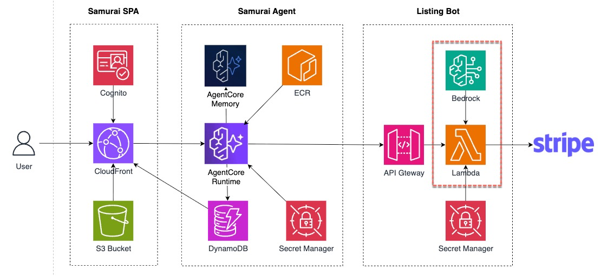
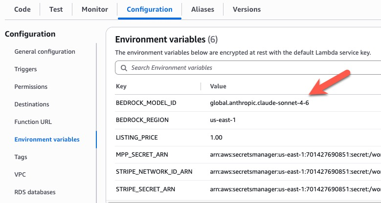

This is the actual LLM call. Everything above it was plumbing — validation, shared payment token creation, credential verification. This is the content: take the validated input, ask Bedrock to write the listing, return it. One Converse call, no agent loop.

Once MPP has verified the payment, the Lambda calls Bedrock to actually write the listing. That call lives in `app/listing-bot-lambda/bedrock.mjs`.



### TODO 3 — Fill in the `ConverseCommand`

Open `app/listing-bot-lambda/bedrock.mjs`. Scroll to `generateListing()`. You will see a `// TODO 3 …` marker with `bedrock.send(/* … */)`.

Fill it in:

```js
const resp = await bedrock.send(new ConverseCommand({
  modelId: MODEL_ID,
  system: [{ text: system }],
  messages: [{ role: 'user', content: [{ text: userText }] }],
  inferenceConfig: { maxTokens: 2048, temperature: 0.5 },
}))
```

Notes:

- `MODEL_ID` defaults to `global.anthropic.claude-sonnet-4-6` — that is a **cross-region inference profile**, not the bare foundation model ARN. Claude Sonnet 4.6 requires this profile.
- `system` is an array because Converse supports system blocks. Ours is a single platform-aware instruction built above.
- `Converse` returns a structured response. We extract text blocks from `resp.output.message.content` and attempt to parse them as JSON (the system prompt asks for JSON-only output).

:::alert{type="info"}
**Same API, any model.** The exact same `ConverseCommand` shape works for Claude Haiku 4.5, Nova Pro, Llama, Mistral, DeepSeek — only the `modelId` string changes. That's the unified Bedrock Runtime API. You'll see it in action in Chapter 6: one env-var flip swaps the model and you re-run the same SPA prompt.
:::

### Redeploy the Lambda

Same block as the previous step — repeated here so you don't have to scroll back:

```bash
cd /workshop/aws-stripe-workshop/app/listing-bot-lambda
npm install --omit=dev
rm -rf dist && mkdir dist
npx esbuild index.mjs --bundle --platform=node --target=node20 --format=esm \
  --external:@aws-sdk/* \
  --banner:js='import{createRequire}from"module";const require=createRequire(import.meta.url);' \
  --outfile=dist/index.mjs
cp rules.json dist/
(cd dist && zip -qr /tmp/listing-bot-lambda.zip .)
aws lambda update-function-code \
  --function-name "$LISTINGBOT_LAMBDA_NAME" \
  --zip-file fileb:///tmp/listing-bot-lambda.zip \
  --region "$AWS_REGION"
cd -
```

### Verify

You can't trigger the Bedrock path directly from curl without a valid SPT in the Authorization header — but you can confirm the Lambda built and deployed without syntax errors:

```bash
aws lambda get-function-configuration \
  --function-name "$LISTINGBOT_LAMBDA_NAME" \
  --region "$AWS_REGION" \
  --query '{State:State, LastUpdateStatus:LastUpdateStatus, LastModified:LastModified}'
```

Expected:

```
{
  "State": "Active",
  "LastUpdateStatus": "Successful",
  "LastModified": "2026-05-06T..."
}
```

Anything other than `Active` + `Successful` means the zip didn't deploy cleanly — re-run the redeploy block. End-to-end verification (watching Bedrock actually generate a listing) happens in step 6 once Samurai is live.

### One API for Any Model

There are many models available in Amazon Bedrock. Let's list all Claude models with global inference endpoints.

```bash
aws bedrock list-inference-profiles | grep '"inferenceProfileId": "global.anthropic.claude'
```

Expected a list of models similar to following:

```
"inferenceProfileId": "global.anthropic.claude-haiku-4-5-20251001-v1:0",
"inferenceProfileId": "global.anthropic.claude-opus-4-6-v1",
"inferenceProfileId": "global.anthropic.claude-sonnet-4-6",
"inferenceProfileId": "global.anthropic.claude-sonnet-4-20250514-v1:0",
"inferenceProfileId": "global.anthropic.claude-sonnet-4-5-20250929-v1:0",
"inferenceProfileId": "global.anthropic.claude-opus-4-5-20251101-v1:0",
"inferenceProfileId": "global.anthropic.claude-opus-4-7",
```

The same `ConverseCommand` works for any Bedrock-hosted model — only the `modelId` string changes. You can easily switch to another model by modifying the environment variable in the Lambda function. No re-deployment of Lambda is required.




### What You Just Did

You wired the **only** tool-free step in ListingBot's flow. Everything else in the Lambda is deterministic (validation, MPP, Stripe); Bedrock is the one LLM call. This is on purpose: *the listing service does not need to be an agent* — a single LLM call through Converse is sufficient. The agent-shaped work lives on the **caller** (Samurai), which orchestrates the human conversation.

At this point your paid API is complete. The next two steps wire up Samurai so you can demo it end-to-end.
