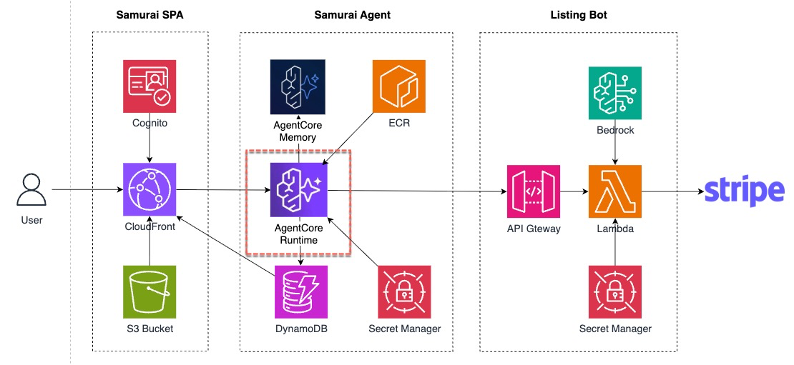
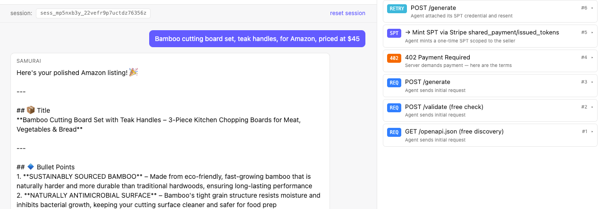

ListingBot is now a complete paid service — it validates, charges, generates, and returns. But to demo it end-to-end you need a user agent that can discover it, pay it, and use it.

**Samurai** is that user agent. It's a Strands TS agent that runs on AgentCore Runtime, uses AgentCore Memory for short-term session state, and calls ListingBot's three endpoints as tools. It's almost fully built — one focused fill-in is left.

| Tool                   | Endpoint            | Cost                    |
|------------------------|---------------------|-------------------------|
| `discover_service`     | `GET /openapi.json` | free                    |
| `check_completeness`   | `POST /validate`    | free                    |
| `generate_listing`     | `POST /generate`    | $1.00 USD via SPT       |



### TODO 4 — Finish the System Prompt

The system prompt is the agent's **steering wheel**. Every decision Samurai makes — when to call a tool, when to ask the human, when to pay — is shaped by it. Every agent built on AgentCore Runtime is steered by a prompt like this one.

Open `app/samurai-agentcore/src/agent.ts`. The prompt has a `// TODO 4 — replace your workflow steps here` marker. Replace that single line with the workflow steps below so Samurai knows the order of operations:

```text
1. If you do not yet know the schema, call discover_service first.
2. If the human's first message reads like a product brief — it contains
  the product, the platform, and enough detail to be at least ~20
  characters — treat the whole message as BOTH the product_name AND the
  description. Do not pester the human for a separate description when
  they have already given you prose that works for both fields.
  Call check_completeness immediately with those derived fields.
3. Only ask a clarifying question when check_completeness returns errors,
  or when the prompt is a bare product name under ~15 characters with no
  descriptive detail (e.g. "yoga mat" alone). In that case, ask ONE
  concise question at a time for the highest-priority missing field.
4. When you believe you have everything required, call
  check_completeness. If it returns errors, ask the human for the
  listed missing fields.
5. Once validation passes, call generate_listing and present the result
  cleanly. Do not fabricate the listing yourself.
6. If the human says things like "try another platform", start again
  from discover_service for that platform (the doc is cached; it's fast).
```

### Build Locally

Compile the code locally and make sure there is no error.

```bash
cd /workshop/aws-stripe-workshop/app/samurai-agentcore
npm install
npm run build      # tsc compile — should succeed with zero errors
cd -
```

### AgentCore Runtime Without Memory

```bash
cd /workshop/aws-stripe-workshop
./workshop/code/participant/participant-deploy.sh
```

The script:

1. Ensures the `samurai-agentcore` ECR repo exists.
2. Builds the Strands TS container for `linux/arm64` and pushes it.
3. Deploys `samurai-agentcore.yaml` — creates Memory + Runtime.
4. Patches `s3://<spa-bucket>/config.json` with the new runtime ARN and invalidates CloudFront so the SPA can call it.

:::alert{type="warning"}
This deployment is expected to take ~3–5 minutes.
:::

Confirm the runtime is `READY`:

```bash
aws bedrock-agentcore-control list-agent-runtimes \
  --region "$AWS_REGION" \
  --query "agentRuntimes[?contains(agentRuntimeName, 'samurai')].[agentRuntimeName,status]" \
  --output table
```

You should see following output, which indicate that Samurai agent is ready.

```
----------------------------------------
|           ListAgentRuntimes          |
+-----------------------------+--------+
|  samurai_agentcore_samurai  |  READY |
+-----------------------------+--------+
```


### Watch Samurai Forget

In the Samurai SPA web portal, send in following message to generate a listing. 

```text
Bamboo cutting board set, teak handles, for Amazon, priced at $45
```

Samurai answers it with a listing from the ListingBot.




Let's send a follow-up message to modify the listing.


```text
Make it more concise.
```

On turn 2, it has no idea what *"it"* refers to — it'll ask you to clarify the product, or say it has no record of an earlier listing, or restart the intake from scratch. 


The exact phrasing varies, but the failure mode is consistent: **Samurai has lost the entire previous turn.** That's exactly what AgentCore Memory is for.

Why? Each `/invocations` call rebuilds a fresh Strands `Agent` from scratch. AgentCore Runtime gives you a session ID via header but does not persist anything by default. The container is stateless across requests; whatever continuity you want has to come from somewhere external.

You'll also notice the **MPP debug panel stays empty on turn 2** — Samurai gave up before calling any paid tool, so no 402 → SPT → 200 handshake fires. The empty panel is the symptom of forgetting, not a deploy bug. 
