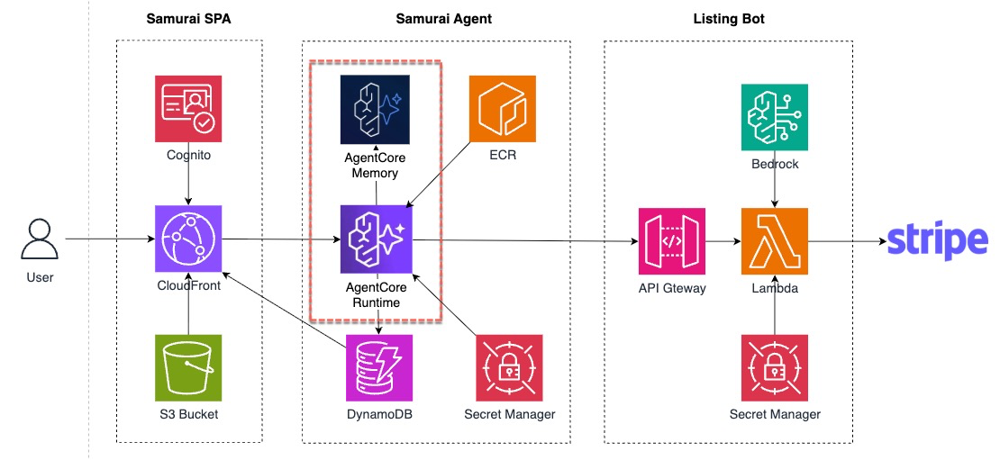
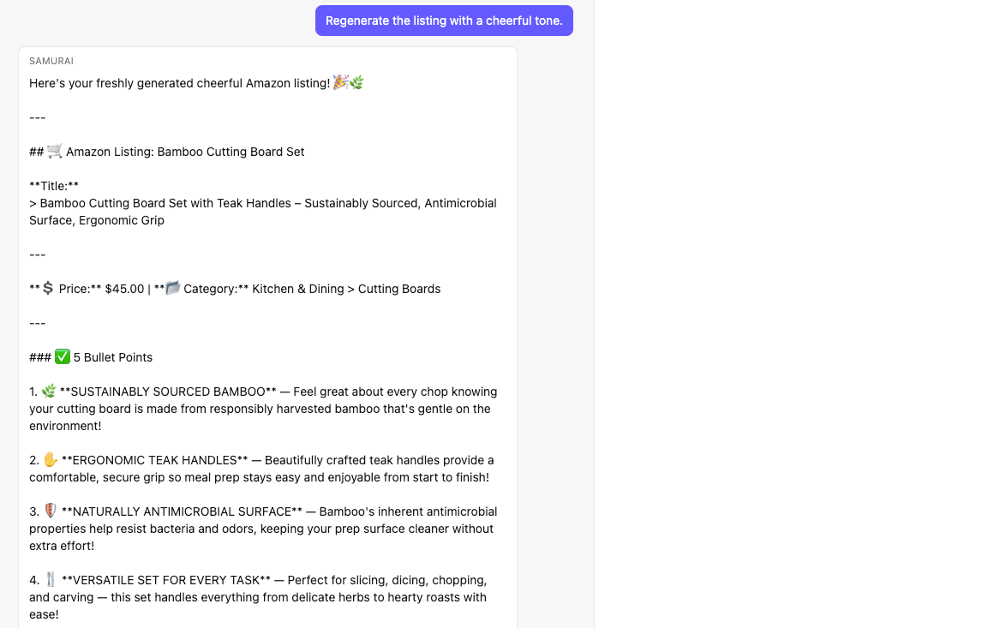
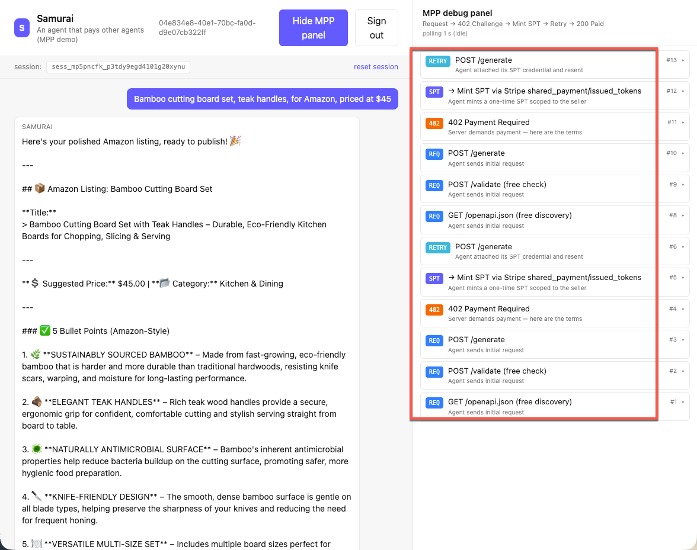
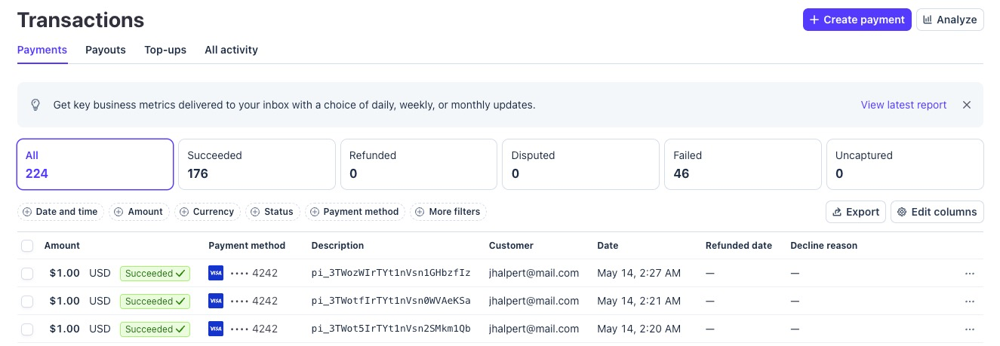

### Wire Memory In

Final piece: deploy Samurai's AgentCore Runtime + Memory, then wire AgentCore Memory into the agent so it can hold short-term session state across turns.



#### TODO 5.1 — Load Message History

Open `memory.ts` and find `loadHistory()` function. Replace **the last `return []`** at the end of function (just below the `// TODO 5.1` block) with the real `ListEventsCommand()` call:

```ts
const resp = await client.send(new ListEventsCommand({
  memoryId: id,
  actorId: ACTOR_ID,
  sessionId,
  includePayloads: true,
  maxResults: HISTORY_LIMIT,
}))
return eventsToMessages(resp.events ?? [])
```

The `eventsToMessages()` function is pre-baked at the top of the file — it walks the event payload, drops non-conversational turns, and format the messages for Strands SDK.

#### TODO 5.2 — Persists Messages

Find `saveTurn()` function and the `// TODO 5.2` block. Add the `CreateEventCommand` call to save messages. 

```ts
await client.send(new CreateEventCommand({
  memoryId: id,
  actorId: ACTOR_ID,
  sessionId,
  eventTimestamp: new Date(),
  payload: [
    { conversational: { role: 'USER',      content: { text: userMsg } } },
    { conversational: { role: 'ASSISTANT', content: { text: assistantMsg } } },
  ],
}))
```

The `index.ts` handler already calls `loadHistory` before `agent.invoke` and `saveTurn` after — you don't need to touch it.

#### TODO 5.3 — Add Memory to Agent

For both functions in `memory.ts` file which we updated in TODO 5.1 & 5.2, when there is no memory resource provided, both functions will skip because there is no memory to persist messages. We will no add memory to the agent. 

Open `workshop/code/participant/samurai-agentcore.yaml`. In the `Runtime` resource's `EnvironmentVariables` block, find the `# TODO 5.3` marker and uncomment the next line:

```yaml
MEMORY_ID: !GetAtt Memory.MemoryId
```

#### TODO 5.4 — Grant Agent Permission to Use Memory

In the same CFN file, scroll up to the `RuntimeExecutionRole` policy. Find the `# TODO 5.4` marker and uncomment the block below it:

```yaml
- Effect: Allow
  Action:
    - bedrock-agentcore:CreateEvent
    - bedrock-agentcore:ListEvents
    - bedrock-agentcore:GetEvent
  Resource: !GetAtt Memory.MemoryArn
```

#### Redeploy

```bash
./workshop/code/participant/participant-deploy.sh
```

Faster this time — Docker layers are cached, so it's mostly the CFN update + Runtime re-roll. Wait until `list-agent-runtimes` shows `READY` again.

### Samurai Remembers Now

**Important: start a fresh conversation** — click **reset session** at the top-right of the chat — so Memory has a clean session id. 

Send in the same messages:

```text
Bamboo cutting board set, teak handles, for Amazon, priced at $45*
```
After you receive the listing response, send another follow-up message:

```text
Regenerate the listing with a cheerful tone.
```

Samurai agent remembers your previous message and act on your latest message accordingly.




Same code path, similar prompts — what changed is that the agent now hydrates `messages` from AgentCore Memory before each invocation, and persists each turn after.

> Heads up: turn 2 fires `generate_listing` again with the new prompt, so it will trigger a **second $1.00 PaymentIntent** on your seller account. 


While you're there, watch the MPP debug panel:



Each row is one hop in the MPP handshake:

- **REQ** — Samurai's initial `POST /generate` (no auth yet)
- **402** — ListingBot's challenge
- **SPT** — Samurai creating the Stripe Shared Payment Token
- **RETRY** — same `POST /generate` with `Authorization: Payment spt=…`
- **200** — ListingBot redeems the SPT and returns the listing

#### Verify the PaymentIntent in Stripe

The retry pass is where the money finally moves. Check your **Stripe Dashboard → Transactions** (seller side — the account whose `profile_test_` you pasted in Chapter 2). A new `PaymentIntent` should appear for $1.00 USD, created via SPT, with the `pm_card_visa` test payment method.



### Congratulations! What You Built

A full two-agent commerce loop with short-term session memory. **You built** ListingBot (API Gateway → Lambda → Stripe + Bedrock Converse) — a paid API any autonomous agent can discover, pay, and call. Samurai (browser → Cognito → AgentCore Runtime → Strands → mppx/client + AgentCore Memory) is the user agent you just deployed, paying your service $1.00 per listing via Stripe SPT and remembering enough conversation context to handle "make that one shorter".
