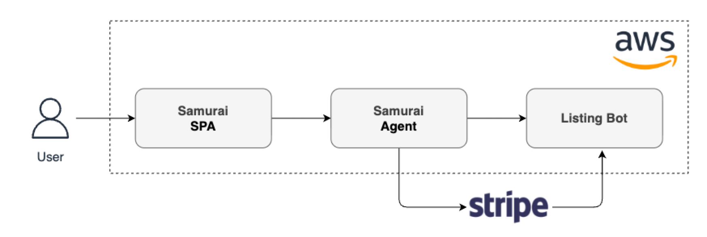
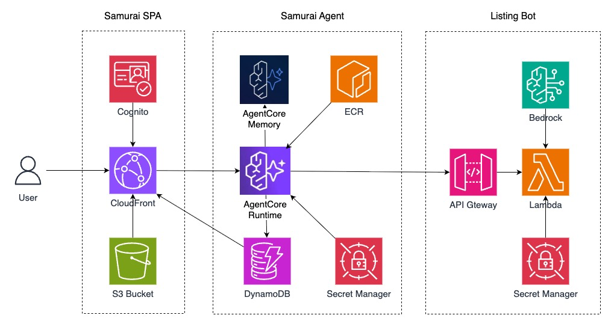
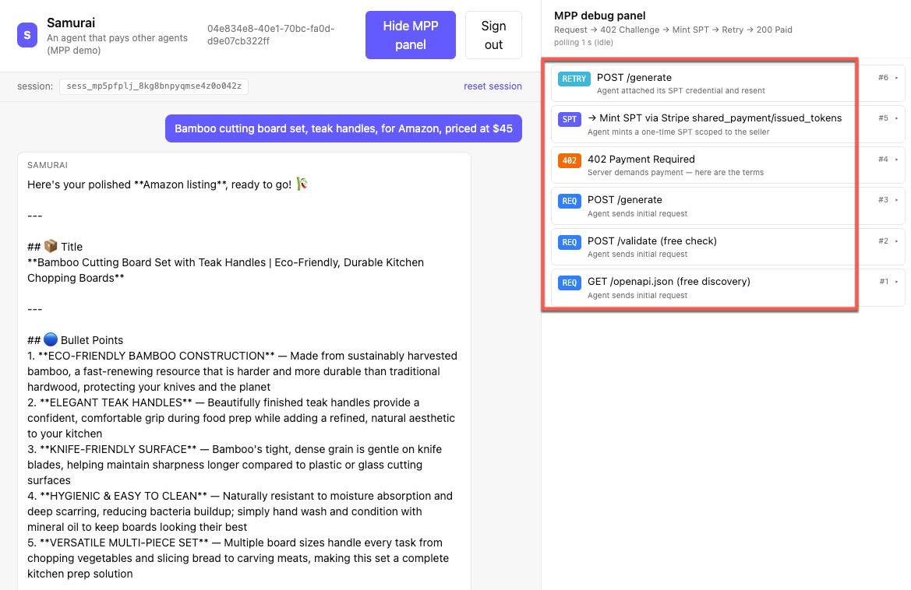

:::alert{type="info"}
**This workshop is available at AWS-run events only.** It is delivered through Workshop Studio and cannot be self-deployed into a personal or customer AWS account. The supporting infrastructure (pre-created Cognito user, Stripe test secret store, Code Editor EC2, MPP logs table) is provisioned by Workshop Studio at event start and reclaimed at event end.
:::

### Who This Workshop Is For

Developers learning to build **agentic commerce** systems — services that autonomous AI agents can discover, **pay for**, and call without a human in the loop. By the end you'll have hands-on experience combining:

- **Machine Payment Protocol** (MPP) for agent-to-service payments with **Stripe**
- **Amazon Bedrock AgentCore** (Runtime + Memory) for hosting the calling agent
- **Strands TypeScript** as the agent framework

Comfort with TypeScript/Node and basic AWS (Lambda, CloudFormation, IAM) is assumed. No prior Stripe or Bedrock experience required.

### The Scenario

You are a builder that runs an AI-powered marketplace-listing generator called **ListingBot** — give it a product description and a platform (Amazon, eBay, Shopify), and it returns a polished listing. Until now, your customers have been humans clicking a web form to get the result.

That is changing now. AI agents are starting to become human assistants for ideas and shopping. A customer might ask AI agents to discover available List Generation services and call your API directly — no humans, no credit cards entry. Agents need to discover your service, pay per call, and move on.

In this project, you will turn **ListingBot** into a paid API that autonomous agents, i.e your customers' personal AI agents, can consume. In this project, we use **Samurai Agent** to simulate such an agent. We also include a web portal called **Samurai SPA** (Single-Page Application) to show the interactions between two systems.

In the next 90 minutes, You will wire up **Machine Payments Protocol (MPP)** using **Shared Payment Tokens (SPT)** with Stripe so every `/generate` call charges $1.00 USD against your Stripe Merchant Profile before LLM outputs the listing. Then you'll watch **Samurai** - one of your customer's cloud-hosted AI agent — discover your service, pay for it, and use it, live, while the payment collected are added into your Stripe Seller account's sandbox. 

### Deployment on AWS

All 3 modules — ListingBot Lambda, Samurai AgentCore Runtime, and the Samurai SPA (Single-Page Application web portal) — are deployed in AWS.

### Your Role Today

You are the **ListingBot Builder.** The core engineering work is on your side:

- **Steps 2–4 Complete ListingBot:** Connect to Stripe, create the 402 payment challenge, generate the listing with Bedrock.
- **Steps 5–6 Wire up the user agent:** Samurai Agent is a Strands agent shipped with the workshop so you can demo ListingBot end-to-end.

You never write the 402-challenge verification, the SPT signing, or the Cognito/SigV4 plumbing — the `mppx` library and Amazon's AgentCore Runtime handle those. You own the business logic.

### What "Done" Looks Like

At the end of the workshop, you'll type a product description into the Samurai SPA and watch the MPP debug panel light up with the full handshake:

### What You Will Build

There are only 5 simple TODOs in this workshop:

- TODOs 1–3: activate and complete ListingBot's paid `/generate` endpoint
- TODOs 4–5: complete Samurai's agent and deploy it on AgentCore Runtime

| # | Steps | Module | What You Do |
|---|---|---|---|
| 1 | Connect ListingBot to Stripe | ListingBot | Paste three values into Secrets Manager: the shared buyer `sk_test_` (shared by instructors at the event) plus your own seller `sk_test_` and `profile_test_` |
| 2 | Create the 402 payment challenge | ListingBot | Fill in the `methods` array on `Mppx.create` with `stripe.charge({…})` |
| 3 | Generate the listing with Bedrock | ListingBot | Fill in `bedrock.send(new ConverseCommand({…}))` |
| 4 | Wire up the user agent | Samurai | Finish Samurai's system prompt — the agent's "steering wheel" |
| 5 | Run the user agent on AgentCore | Samurai | Deploy Samurai, demo the no-Memory failure, then wire AgentCore Memory in three places (agent code · CFN env · IAM) and watch it remember |

### Background Knowledge

You'll move faster if you're already comfortable with:

- **TypeScript / Node.js 20** — you'll edit small functions in a Lambda handler and a Strands agent.
- **AWS Lambda + API Gateway** — ListingBot is a single Lambda behind an API Gateway REST API; you should recognise the handler signature and how routes map to it.
- **CloudFormation basics** — you'll add one line to a nested CFN template (no authoring from scratch).
- **REST + HTTP status codes** — the workshop hinges on `400 / 422 / 402 / 200`; knowing what each means in a normal API makes the MPP twist click.
- **IAM at a glance** — you won't write policies, but reading a role's permissions helps when debugging.

**No prior experience required** with Stripe MPP, Amazon Bedrock, AgentCore, or the Strands framework — the workshop teaches what you need as you go.

### Prerequisites & Time

- **~90 minutes.** You can keep going after the timer if the stretch ideas in the Wrap-up look fun.
- **Laptop with a modern browser.** Everything runs in the browser — the Samurai SPA, the in-browser VS Code (Code Editor), and the AWS Console.
- **The Outputs tab of the root CloudFormation stack open in one browser tab.** You'll reference `CodeEditorUrl`, `SpaUrl`, `TestUsername`, and `TestUserPassword` from there.

### Costs

:::alert{type="info"}
**AWS covers all charges during this event.** The infrastructure runs in a Workshop Studio sandbox account created at event start and reclaimed at event end — you will not receive a bill. The table below is a **reference estimate** in case you later want to build similar infrastructure in your own account.
:::

A 90-minute run in `us-east-1` costs **~$0.50 – $1.00**, dominated by the `t3.xlarge` Code Editor EC2 and Bedrock Converse calls. An idle stack left running costs **~$4/day** for the EC2 + EBS volume.

| Service                                     | Contribution (per 90-min run)                          | Pricing                                                                                                                                                             |
| ------------------------------------------- | ------------------------------------------------------ | ------------------------------------------------------------------------------------------------------------------------------------------------------------------- |
| EC2 `t3.xlarge` Code Editor + 30 GB gp3 EBS | ~$0.25 (**~$4/day if left running**)                   | [EC2](https://aws.amazon.com/ec2/pricing/on-demand/) · [EBS](https://aws.amazon.com/ebs/pricing/)                                                                   |
| Amazon Bedrock — Claude Sonnet 4.6 Converse | $0.10 – $0.40                                          | [Bedrock pricing](https://aws.amazon.com/bedrock/pricing/)                                                                                                          |
| Bedrock AgentCore Runtime + Memory          | < $0.25                                                | [AgentCore pricing](https://aws.amazon.com/bedrock/agentcore/pricing/)                                                                                              |
| Lambda + API Gateway + DynamoDB (on-demand) | < $0.05                                                | [Lambda](https://aws.amazon.com/lambda/pricing/) · [API Gateway](https://aws.amazon.com/apigateway/pricing/) · [DynamoDB](https://aws.amazon.com/dynamodb/pricing/) |
| CloudFront + S3 + Cognito                   | $0 (within free tier for new accounts)                 | [CloudFront](https://aws.amazon.com/cloudfront/pricing/) · [Cognito](https://aws.amazon.com/cognito/pricing/)                                                       |
| Secrets Manager (4 secrets)                 | ~$0.05                                                 | [Secrets Manager](https://aws.amazon.com/secrets-manager/pricing/)                                                                                                  |
| Stripe **sandbox** account                  | $0 (sandbox Stripe Profile + test SPTs, no real money) | [Stripe pricing](https://stripe.com/pricing)                                                                                                                        |
