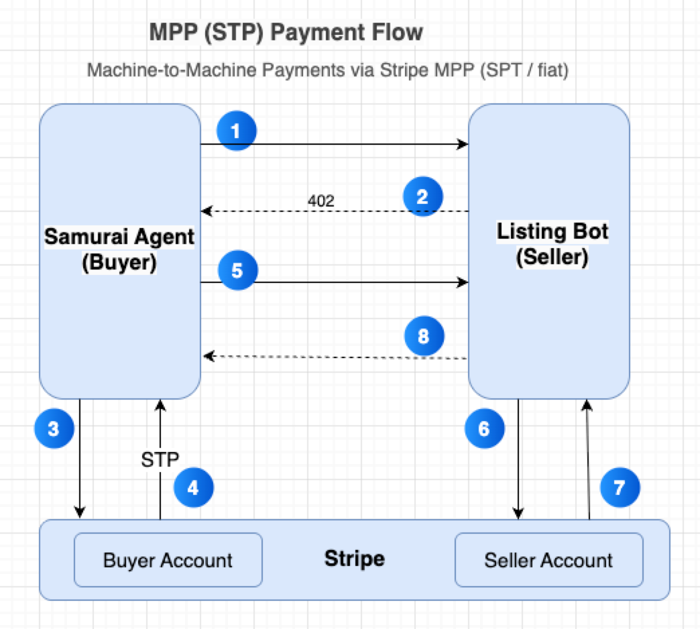

### Machine Payments at the age of Agents
When building agents or agentic services, the usage of services always mean underlying token usages, adding a monetization / payment layer becomes increasingly important. Traditionally, human pays directly on a website, and complete the checkout directly. With the rise of agents, the very things that make these payment flows familiar and fast for human purchasers are structural headwinds for programmatic consumption.

[Machine Payments Protocol](https://mpp.dev/) (MPP) is the open protocol for machine-to-machine payments. You can charge for API requests, tool calls, or content—agents and apps pay per request in the same HTTP call. MPP supports payments in different mode, and for today we will implementing a charge per API call. Read more [here](https://stripe.com/blog/machine-payments-protocol)

For today's workshop,  we will explain the system flow focusing on machine payments with cards through Stripe's [Shared Payment Token](https://docs.stripe.com/agentic-commerce/concepts/shared-payment-tokens?agent-seller=agent). 
### The MPP Handshake in Plain English

Two roles: the **buyer agent** (an AI agent — Samurai in this workshop) and the **seller** (a paid HTTP service — ListingBot in this workshop).

1. **Buyer requests a paid service.** The buyer sends a normal HTTP request to the seller.
2. **Seller challenges.** If payment is required, `mppx` on the Seller Service will responds `402 Payment Required` with a `WWW-Authenticate: Payment …` header containing the price and terms to indicate payment is required for this resource. Read more about [402 response](https://mpp.dev/protocol/http-402).
3. **Buyer creates a credential.** The buyer calls Stripe to create a **Shared Payment Token (SPT)** scoped to this specific seller's Stripe Profile, for the exact amount the challenge demands. (This is the step where buyer agent might use a stored payment credential authorised by the human, or present a credential collection form securely)
4. **Buyer retries with the credential.** Same HTTP request, plus `Authorization: Payment spt=…` containing the fresh SPT. No credit card, no human in the loop at request time.
5. **Seller redeems and responds.** The seller hands the SPT to `mppx/server`, which creates a PaymentIntent against the correct Stripe seller account using the SPT. On success, the seller returns `200 OK` together with the paid-for content.

That's the whole protocol. In a real-world deployment the buyer's payment method can be approved once by a human, then the agent creates per-call SPTs autonomously until the approval expires or the human revokes it.

### Where You Fit In

**You own the server side.**  Steps 2–4 of workshop will wire up ListingBot to register the `stripe.charge` payment method with `mppx/server`, to call Bedrock once the payment verifies, and to handle the four response tiers (400 / 422 / 402 / 200).

You do **not** need to write the verification step — that lives in the `mppx/server` library bundled with the Lambda, which creates a Stripe PaymentIntent from the SPT on your behalf. You also don't write Samurai's SPT-creation code — that's `mppx/client` inside the Strands container.

Your boundary is clear: implement the merchant's business logic and plug it into the MPP library. Everything else is handled.

### The Protocol in One Picture

Steps when **Samurai Agent** tries to consume service provided by **Listing Bot**:

1. Buyer → Seller : Request service
2. Seller → Buyer : Respond 402 + challenge { amount, currency, challengeId, seller profile_test_… }
3. Buyer → Stripe : `POST /v1/shared_payment/issued_tokens` — create a one-time SPT scoped to the seller's profile, capped at the challenge amount
4. Stripe → Buyer : `{ id: "spt_test_…" }`
5. Buyer → Seller : Request service + `Authorization: Payment spt=spt_test_...`
6. Seller → Stripe : `paymentIntents.create({ payment_method_data: { shared_payment_granted_token: spt }, ... })` (handled by `mppx/server`)
7. Stripe → Seller : PaymentIntent `succeeded`
8. Seller → Buyer : 200 OK + service + Payment-Receipt header

### Why ListingBot Has **Three** Endpoints

Your service has to answer three kinds of questions: *"what do you do?"*, *"would my input be valid?"*, and *"do the work."* Only the third costs money.

- **`GET /openapi.json`** — free service discovery. Samurai calls this first to learn what fields each marketplace needs. If you add a new platform, Samurai picks it up with zero code changes.
- **`POST /validate`** — free input check. Samurai calls this once it thinks it has enough input, so the caller is never charged for a request that would fail validation.
- **`POST /generate`** — paid. On malformed JSON → 400. On invalid input → 422 with an RFC 7807 problem document (no payment taken). On missing payment → 402. Otherwise → 200 with the listing.

This tiered shape is MPP-compliant: payments only happen for *requests that would actually do work*. If validation fails, MPP never fires.

### Why SPT Is Headless After First Approval

- **One-time human approval.** A Shared Payment Token can be created once, up front, when the buyer agent's owner approves the spend scope (e.g, maximum amount, expiry). The SPT is then stored wherever your agent keeps secrets — in this workshop, AWS Secrets Manager.
- **Per-call headlessness.** Once the SPT exists, every 402 → retry → 200 cycle is fully machine-to-machine. The seller agent receives the SPT from the buyer agent on retry; `mppx/server` hands it to Stripe with `payment_method_data[shared_payment_granted_token]=spt_...`; then Stripe creates a PaymentIntent and settles it against the agent's Stripe merchant account — no user redirect, no card entry across different machines, no signature at request time.
- **`mppx/server` hides `paymentIntents.create`.** You register `stripe.charge({ networkId, secretKey, ... })` with `Mppx.create` and the library handles the rest: challenge generation, credential verification, idempotent PaymentIntent creation, receipt signing. You never call Stripe directly.
