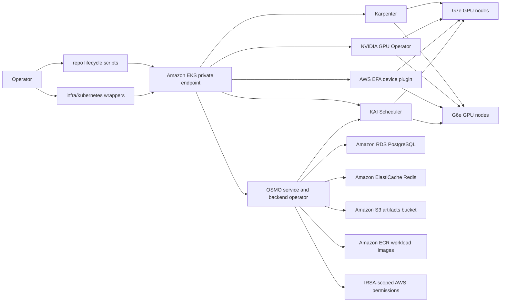

# Architecture

This repo provides a minimal AWS sample for NVIDIA OSMO robotics foundation model workflows. It keeps OSMO external and pinned, then supplies an AWS-native deployment path around it.

## Baseline

- EKS control plane with private endpoint enabled by default.
- CPU worker nodes in private subnets, sized with enough workflow-allocatable CPU for the OSMO and KAI control planes plus the smoke workflow.
- Amazon RDS PostgreSQL for OSMO service metadata.
- Amazon ElastiCache for Redis with transit and at-rest encryption.
- Amazon S3 bucket with KMS encryption, versioning, and public access block.
- IAM role for service accounts scoped to the OSMO Kubernetes service account.
- KAI Scheduler installed from the pinned OCI Helm chart. OSMO backend scheduling is configured with `scheduler_type: kai` and `scheduler_name: kai-scheduler`.
- Karpenter controller IAM, Pod Identity, node role, and interruption queue are created by Terraform.
- The G7e and G6e NodePools use private subnet and node security group discovery tags, On-Demand capacity, IMDSv2, encrypted gp3 root volumes, the pinned EKS AL2023 NVIDIA AMI, and empty-node consolidation. The default intentionally avoids underutilized replacement during GPU validation runs; operators can opt into faster cleanup by overriding `KARPENTER_CONSOLIDATION_POLICY` and `KARPENTER_CONSOLIDATE_AFTER`. For repeatable multi-node EFA runs, `infra/kubernetes/deploy-karpenter.sh` can also bind the EC2NodeClass to targeted EC2 Capacity Reservation or Capacity Block IDs through `KARPENTER_CAPACITY_RESERVATION_IDS`.
- The OSMO GPU pod template adds `karpenter.sh/do-not-disrupt=true` to active workflow pods and mounts a memory-backed `/dev/shm` volume. This prevents Karpenter disruption from evicting long-running training pods and supports NIM and TensorRT-style shared-memory needs.
- NVIDIA GPU Operator installs device plugin and telemetry components while leaving driver and toolkit installation disabled because they are included in the EKS AL2023 NVIDIA AMI.
- AWS EFA device plugin exposes `vpc.amazonaws.com/efa` on EFA-capable GPU nodes. Its DaemonSet tolerates `nvidia.com/gpu=true:NoSchedule`, matching the Karpenter GPU NodePool taint.

## EFA Mode

EFA is an optional node capability, not a requirement for every GPU workflow. The EFA device plugin can be installed before any EFA-capable node exists. On unsupported instance types, the DaemonSet does not schedule and the node does not expose `vpc.amazonaws.com/efa`.

The current G7e pool includes both EFA and non-EFA sizes. `g7e.2xlarge` and `g7e.4xlarge` are valid GPU-only choices, while `g7e.8xlarge`, `g7e.12xlarge`, `g7e.24xlarge`, and `g7e.48xlarge` are EFA-capable choices in the validated region. The G6e pool is constrained to `g6e.8xlarge` for the validated OSMO EFA workflows. Workloads that do not request `vpc.amazonaws.com/efa` continue to run as GPU-only workloads. Workloads that request `vpc.amazonaws.com/efa` must land on an EFA-capable node with the plugin running, otherwise Kubernetes will leave them pending for insufficient EFA.

The EKS node security group includes self-referenced all-traffic ingress and
egress rules. This is required for EFA/NCCL and MPI workloads, and was validated
with the 2-node G6e NCCL benchmark in
`benchmarks/g6e-efa-nccl`.

## Workload Flow

OSMO owns workflow orchestration, KAI owns Kubernetes scheduling decisions, Karpenter owns EC2 capacity provisioning, the GPU Operator exposes `nvidia.com/gpu`, and the AWS EFA device plugin exposes `vpc.amazonaws.com/efa` on joined GPU nodes. The reference keeps these layers separate so AWS infrastructure can be updated without vendoring or patching OSMO.

Larger Isaac and Cosmos production workflows are intentionally outside the first GPU commit and should be added after the GPU provisioning path is reproducible.
